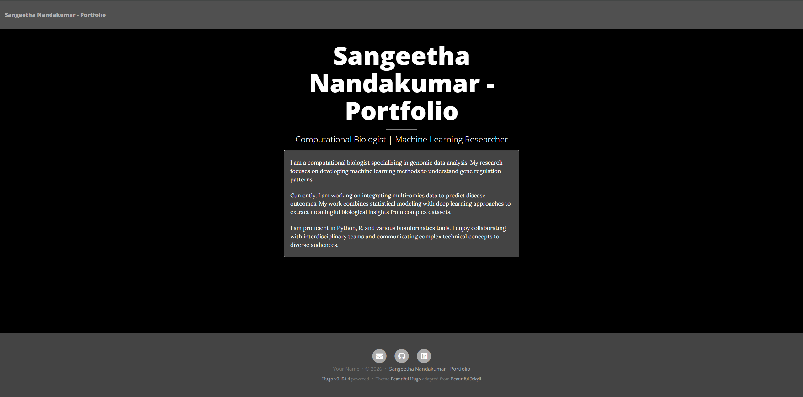
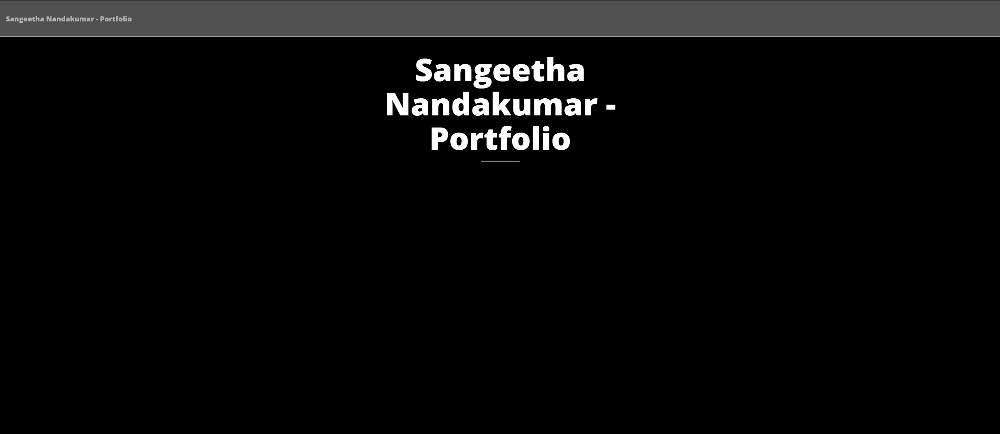
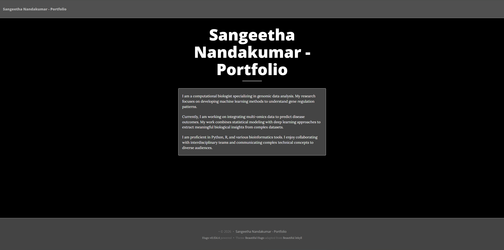

# A Single-Page Portfolio (using Beautiful Hugo theme) - SOLUTIONS

Hugo builds websites by reading files from a computer and turning them into web pages. Content is written in Markdown files, extra information is stored in front matter, and themes and configuration files control how the site looks.

Here we will see:

- how Hugo is used locally
- how a single-page homepage is created
- how themes control the appearance of the site



---

## Section 1: Initial Setup

Hugo needs a project structure and a theme before it can display content. Without a theme, Hugo has no templates to turn Markdown files into web pages. This section covers the essential setup steps that must happen before creating any content.

This section covers creating a new Hugo site, learning how the local server works, installing a theme using Hugo Modules, and configuring basic theme settings. By the end of this section, there will be a working site ready to receive content.

At the end of this section, the portfolio will look something like this:


| Command | Description |
|---------|-------------|
| `hugo new site <n>` | Create a new Hugo site with the specified name |
| `cd <directory>` | Navigate into a directory |
| `ls` (Mac/Linux) or `dir` (Windows) | List files and directories in the current location |
| `hugo server -D` | Start the Hugo development server (includes draft content) |
| `Ctrl+C` | Stop the running server |
| `hugo mod init <module-path>` | Initialize Hugo Modules for the project |
| `hugo mod get <module-path>` | Download and add a Hugo module (like a theme) |

---

### Creating a Hugo site

Hugo is a tool that builds websites from files on a computer. Content is written in simple text files, and Hugo converts them into web pages. 

When creating a new Hugo site, it sets up a folder structure with all the necessary directories. This structure tells Hugo where to find content, themes, and configuration settings.

---

**Example** Create a new Hugo site called `my-portfolio`, navigate into the directory, and list the contents. You should see directories like `archetypes`, `assets`, `content`, `data`, `i18n`, `layouts`, `static`, and `themes`, along with a `hugo.toml` file.

```bash
hugo new site my-portfolio
cd my-portfolio
ls
```

---

**Exercise** Verify that the `content` directory exists by looking at the output from the previous command. This is where all content files will be stored.

**Solution:**
The `content` directory should be visible in the `ls` output.

---

**Exercise** Verify that the `hugo.toml` file exists in the root directory. This file will be used to configure the site settings.

**Solution:**
The `hugo.toml` file should be visible in the `ls` output.

---

### Understanding the local server

Hugo includes a web server that runs on a computer. This server lets browsers display the website before publishing it online. The server watches files, and when a change is saved, it automatically rebuilds the site and refreshes the browser.

The server can be left running while working, though sometimes it may need to be restarted to see certain changes.

---

**Example** Start the Hugo development server and view the site in a browser. Open `http://localhost:1313/` and you will see a "Page Not Found" message, which is normal because there is no theme yet.

```bash
hugo server -D
```

---

**Exercise** Keep the server running and note which terminal window it's running in. You will need to access this terminal later to stop and restart the server.

**Solution:**
Leave the terminal running. No action needed.

---

**Exercise** Stop the server by pressing `Ctrl+C` in the terminal, then restart it with `hugo server -D` to practice the restart process.

**Solution:**
```bash
# Press Ctrl+C, then:
hugo server -D
```

---

### Adding a theme using Hugo Modules

A Hugo theme is a collection of templates, stylesheets, and assets that control how a site looks. Without a theme, Hugo cannot display content because it has no templates to render it.

Hugo Modules is the modern way to add themes to a site. Instead of downloading theme files into the project, the theme is declared as a dependency. Hugo then downloads and manages it.

In this subsection, you will practice adding different themes to see how Hugo Modules works and how different themes change the site's appearance.

---

**Example** Initialize Hugo Modules for the project, then add the Ananke theme. Replace `yourusername` with any name - it doesn't need to be a real GitHub username for local development.

```bash
hugo mod init github.com/yourusername/my-portfolio
hugo mod get github.com/theNewDynamic/gohugo-theme-ananke/v2
```

After running these commands, look at the `go.mod` file that was created in the project root. This file tracks the Hugo modules (themes and other dependencies) used by the project.

---

**Exercise** Add the Hugo Coder theme by running `hugo mod get github.com/luizdepra/hugo-coder`, look at the `go.mod` file, and verify that it now also shows the Hugo Coder theme.

**Solution:**
```bash
hugo mod get github.com/luizdepra/hugo-coder
```

---

**Exercise** Add the Beautiful Hugo theme by running `hugo mod get github.com/halogenica/beautifulhugo`, examine the `go.mod` file, and verify it now references Beautiful Hugo. We will use this theme for the rest of the workshop because it provides good options for portfolios.

**Solution:**
```bash
hugo mod get github.com/halogenica/beautifulhugo
```

---

### Enabling and configuring the theme

After adding a theme, Hugo must be told to use it. With Hugo Modules, the theme is imported in the configuration file using the module import syntax. The configuration file is where Hugo looks for site-wide settings.

Themes come with their own set of configurable options. These options let customization of colors, layouts, features, and behavior without editing theme files directly.

---

**Example** Open the `hugo.toml` file and add the module configuration to import the Ananke theme, then start the server.

```toml
[module]
[[module.imports]]
path = "github.com/theNewDynamic/gohugo-theme-ananke/v2"
```
---

**Exercise** Change the theme to Coder.

**Solution:**
```toml
[module]
[[module.imports]]
path = "github.com/luizdepra/hugo-coder"
```
---

**Exercise** Change the theme to Beautifulhugo.

**Solution:**
```toml
[module]
[[module.imports]]
path = "github.com/halogenica/beautifulhugo"
```
---


**Exercise** Add `title = 'Your Name - Portfolio'` to the top of `hugo.toml` (before the `[module]` section), restart the server, and verify the title appears in the site header and browser tab.

**Solution:**
```toml
title = 'Your Name - Portfolio'

[module]
[[module.imports]]
path = "github.com/halogenica/beautifulhugo"
```

---

## Section 2: Creating Homepage

Now that the site has a working theme, content can be created that will actually display. For a single-page portfolio, only one content file called `_index.md` is needed. This file becomes the homepage.

This section shows how to create the homepage file, add paragraph content, and configure front matter settings. The focus is on writing simple paragraph text without using headings, lists, or links.




| Command | Description |
|---------|-------------|
| `hugo new <filename>` | Create a new content file with default front matter |
| `---` | Delimiters that mark the start and end of front matter |
| `draft: true` | Front matter setting that marks content as a draft |
| `draft: false` | Front matter setting that marks content as published |
| `title: "text"` | Front matter setting for the page title |

---

### Creating the homepage file

The file named `_index.md` defines the homepage of the site. Hugo treats this file differently from other content files. For a single-page portfolio, this is the only content file needed.

Hugo provides a command to create content files with the correct front matter automatically. This avoids mistakes that can happen when creating files manually.


---

**Example** With the server running in one terminal, open a new terminal window, navigate to the `my-portfolio` directory, and create the homepage file.

```bash
hugo new _index.md
```

---

**Exercise** Open `content/_index.md` in a text editor and examine the front matter that Hugo automatically added between the `+++` delimiters. You should see fields like `title`, `date`, and `draft`.

**Solution:**
Open `content/_index.md` - no commands needed.

---

Keep both terminal windows visible - one running the server and one for executing commands. Practice switching between them to get comfortable with the workflow.

---

### Adding content

With the homepage file created, paragraph content can now be added that will display in the browser. Content is written below the front matter (after the second `+++` line).

For this workshop, focus on writing simple paragraphs. No headings, lists, or links are needed. Just plain paragraph text.

---

**Example** In `content/_index.md`, add a self-introduction paragraph below the front matter, save the file, and check the browser. The paragraph should appear on the page.

```markdown
+++
date = '2026-01-12T19:03:27+01:00'
draft = false
title = ''
+++

I am a researcher working on interesting problems in data science and machine learning. This is my portfolio website where I share information about my work and projects.
```

---

**Exercise** Change the paragraph text to write about your own background or interests, save the file, and verify the browser automatically updates with your new text.

**Solution:**
```markdown
I am a computational biologist specializing in genomic data analysis. My research focuses on developing machine learning methods to understand gene regulation patterns.
```

---

**Exercise** Add a second paragraph below the first one about your current research or work focus, save the file, and verify both paragraphs appear on the page with appropriate spacing between them.

**Solution:**
```markdown
I am a computational biologist specializing in genomic data analysis. My research focuses on developing machine learning methods to understand gene regulation patterns.

Currently, I am working on integrating multi-omics data to predict disease outcomes. My work combines statistical modeling with deep learning approaches to extract meaningful biological insights from complex datasets.
```

---

### Setting up homepage front matter

Front matter is a block of information at the top of the content file. It sits between two lines of three dashes (`+++`). Hugo reads this information to understand how to handle the page.

Front matter settings control metadata like the page title, whether content is published or a draft, and other page-specific options.

---

**Example** Change the `draft` setting from `true` to `false` in the front matter, save the file, and verify the page still displays (this confirms the content is no longer marked as a draft).

```toml
+++
date = '2026-01-12T19:03:27+01:00'
draft = false
title = ''
+++
```

---

**Exercise** Add a third paragraph to your content about your skills or interests, save the file, scroll through the page, and verify all three paragraphs display correctly with the updated title in the browser tab.

**Solution:**
```markdown
I am proficient in Python, R, and various bioinformatics tools. I enjoy collaborating with interdisciplinary teams and communicating complex technical concepts to diverse audiences.
```

---

## Section 3: Customizing Portfolio

The portfolio now has content and structure. This section covers customization options that make the portfolio more professional and personalized. This includes configuring theme-specific settings and exploring different theme options.

Theme configuration lets you adapt the appearance and functionality to match your needs without editing code or templates.


| TOML Syntax | Description |
|-------------|-------------|
| `[params]` | Section in config file for theme parameters |
| `key = "value"` | Setting a parameter with a string value |
| `key = true` | Setting a boolean parameter |
| `[[module.imports]]` | Importing a Hugo module (theme) |

---

### Configuring the theme appearance

Beautiful Hugo theme provides configuration options to customize how the site looks and behaves. These settings are added to the `hugo.toml` file under a `[params]` section.

Each theme has its own set of parameters. By modifying these parameters, you can change colors, fonts, layout options, and other visual elements.

---

**Example** Add a `[params]` section to `hugo.toml` with a subtitle parameter, save the file, restart the server with `hugo server -D`, and verify the subtitle appears below the site title in the header.

```toml
[params]
subtitle = "Researcher and Data Scientist"
```

---

**Exercise** Change the subtitle to something that describes your work or interests, save the file, restart the server, and verify the new subtitle appears in the site header.

**Solution:**
```toml
subtitle = "Computational Biologist | Machine Learning Researcher"
```
---

### Configuring author information

Beautiful Hugo theme provides parameters to add author information to your portfolio. This includes your name, a brief bio, and social media links. These settings personalize the site and make it easier for visitors to learn about you and connect with you.

Author information is added to the `[params]` section of `hugo.toml` and appears in various parts of the site depending on the theme's design.

---

**Example** Add your name and a brief bio to the `[params]` section in `hugo.toml`, save the file, restart the server, and verify the information appears on the site.

```toml
[params.author]
name = "Your Name"
```

---

**Exercise** Add social media links by including `github = "yourusername"` and `linkedin = "yourusername"` in the `[params]` section, save the file, restart the server, and verify the social media icons appear on the site with working links.

**Solution:**
```toml
github = "janesmith"
linkedin = "jane-smith-bio"
```

---

**Exercise** Add an email contact by including `email = "your.email@example.com"` in the `[params]` section, save the file, restart the server, and verify the email link appears and opens your email client when clicked.

**Solution:**
```toml
email = "jane.smith@university.edu"
```

---

**Note about theme parameters:**

Each Hugo theme has its own unique set of parameters for author information and other settings. Always refer to the theme documentation to see what parameters are available. For Beautiful Hugo, see: https://github.com/halogenica/beautifulhugo

---

## Exploring More Themes and Features

Hugo has hundreds of themes available with different designs and features at https://themes.gohugo.io/. When finding a theme, follow its installation instructions and refer to its documentation for configuration options. Different themes may require different configuration parameters and have different features.

You can continue customizing your portfolio by:
- Exploring additional Beautiful Hugo parameters in the theme documentation
- Adding more content sections to your homepage
- Trying different themes to find one that best matches your style
- Configuring advanced features like analytics, comments, or custom CSS

---